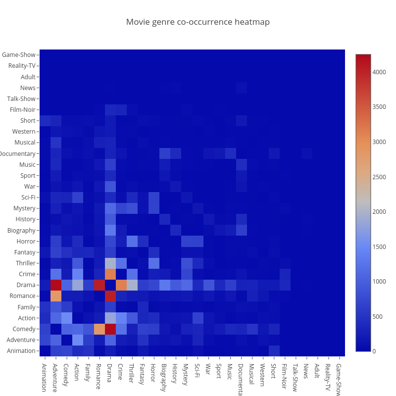
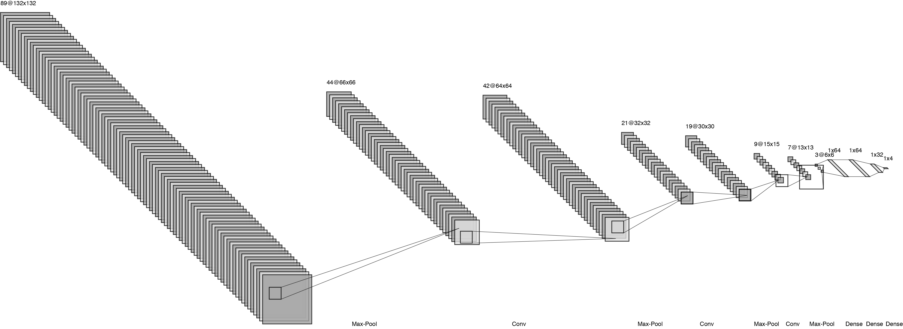
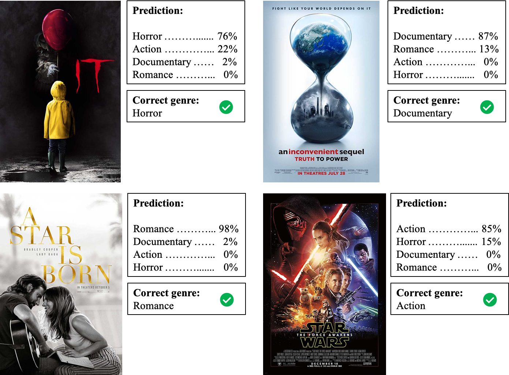
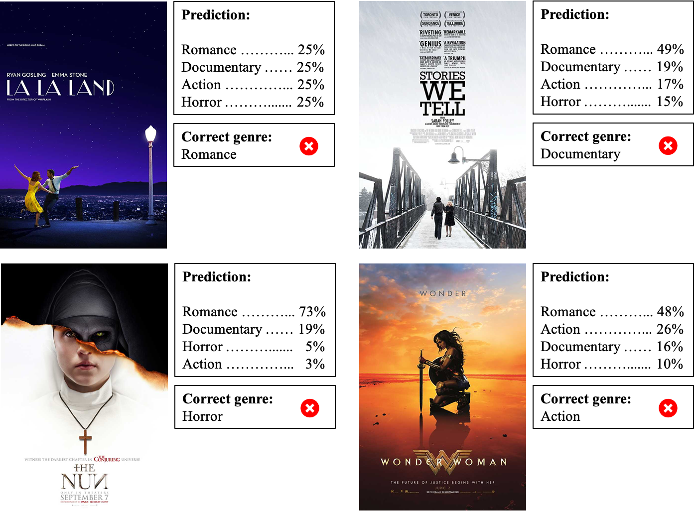
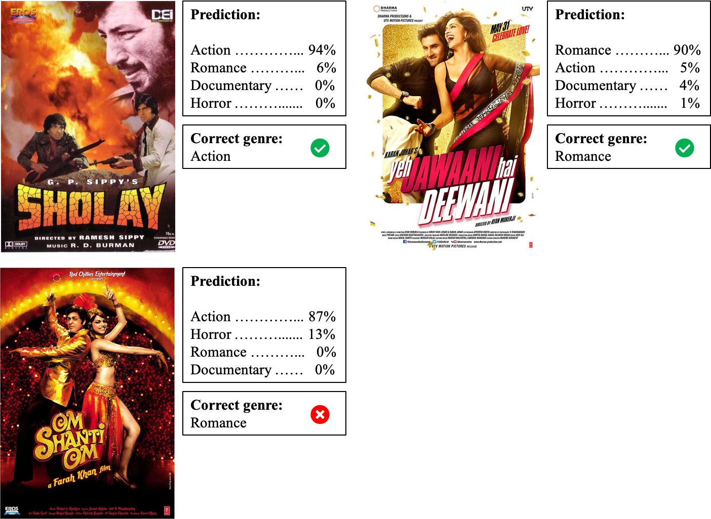
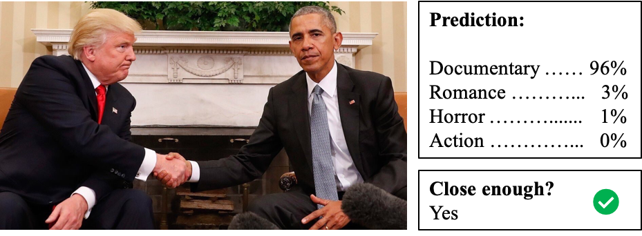

# Movie Genre Prediction


Movies are an essential part of our lives and today when we come across a movie poster we can quickly grasp elements like color, facial expression, objects and much more to get an accurate intuitive understanding of what kind of a movie it would be. Inspired by this human behavior, in this code, I construct a 7-layer convolutional neural network that can describe visual appearance of a movie poster to classify it into one or more genres. Hence, solving this multi-label classification problem.

# Getting started

Movie Genre Prediction (MGP) is easy to setup and is written in Python3, make sure you have the following dependencies installed:

```
Keras
numpy
Pandas
PIL
urllib
Tensorflow
pickle
```

Before we run the code, lets get an intuitive understanding of the dataset.

## Dataset



The [dataset](code/data/MovieGenre.csv) consists of 44,000 movie posters scraped from [IMDB](https://www.imdb.com/). Each poster can have multiple genres associated with it. Below is a sample of the dataset.

imdbID | Imdb Link | Title | IMDB Score | Genre | Poster |
--- | --- | --- | --- | --- | --- |
114709 | http://www.imdb.com/title/tt114709 | Toy Story (1995) | 8.3 | Animation, Adventure, Comedy | https://images-na.ssl-images-amazon.com/images/M/MV5BMDU2ZWJlMjktMTRhMy00ZTA5LWEzNDgtYmNmZTEwZTViZWJkXkEyXkFqcGdeQXVyNDQ2OTk4MzI@._V1_UX182_CR0,0,182,268_AL_.jpg

## Model design



In this code I construct a 7-layer CNN for this multi-label classification problem. The general idea is to mimic a VGG net with customized kernel size and output layer. This is an interesting approach because VGG-16 has proven to be accurate in extracting small details from an image on the ImageNet dataset. Therefore, the idea is to see if this customized, mini VGG styled CNN can extract granular features from movie posters and eventually predict its genre.

## Training the model

To train the model run the Python3 scripts in the following order. First download the movie posters from links given in the [dataset](code/data/MovieGenre.csv) file.

```
python3 data_download.py
```

Once downloaded, train the model by running the main file.

```
python3 main.py
```

That's it, your model is trained! (ps. training takes time so run this on a GPU server).

## Testing the model

To test the model run the following script.

```
python3 test.py
```

## Testing the model on external files

To test the model on your favorite movie poster, grab the movie poster's url and run the following script.

```
python3 external_test.py <path/to/directory/where-models-are-saved> <movie-name>
```

Then you will be prompted to enter the poster url. Paste your poster url here and hit enter.

# Results

The models yields interesting results. Here are some movie genres that were predicted correctly.



Similarly here are some movie genres that were predicted incorrectly by the model.



Since the model was entirely trained on Hollywood movie data, I decided to run test it on some Bollywood movies and the model did surprisingly well.



Afterall, it seems like there are some underlying features in movie posters that are universal and can be understood for all movies across different cultures.

To have some fun, I also ran the model on some pictures from the internet.




To read more, checkout the [paper](paper/predicting-movie-genres-paper) that I wrote around this code.

# License information 

This work is licensed under a [Creative Commons Attribution 4.0 International License](https://creativecommons.org/licenses/by/4.0/).

This program is created by [Nirman Dave](http://www.nirmandave.com) as a form of final project for *Neural Networks: A Modern Introduction CS682* course at *University of Massachusetts, Amherst* under *Professor Erik Learned Miller*.
